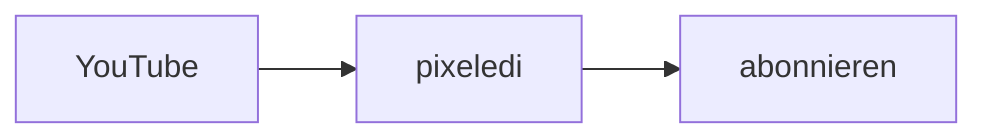
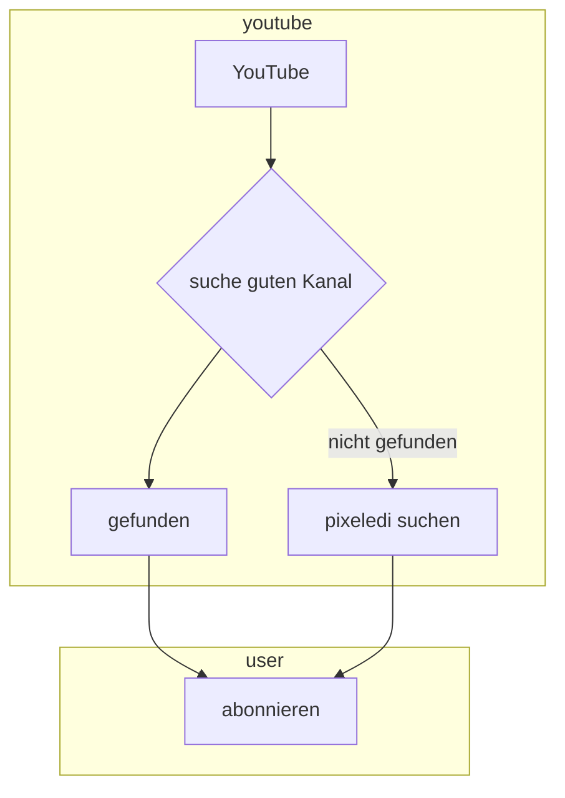
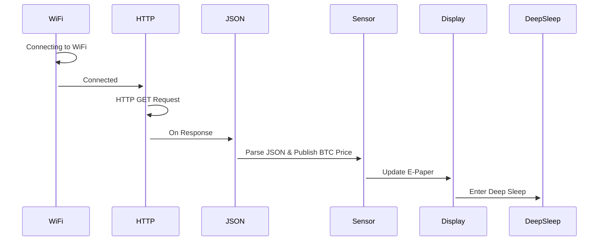

## Markdown Mermaid 

### Links
- VS-Code Extension: https://marketplace.visualstudio.com/items?itemName=bierner.markdown-mermaid
- Mermaid Live via Browser: https://mermaid.live/edit
- Mermaid Syntax: https://mermaid.js.org/intro/getting-started.html

### Bsp. 1

### Bsp. 2

### Bsp. 3
