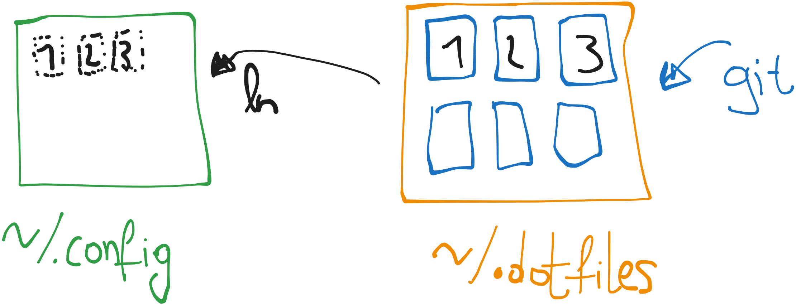

# .dotfiles mit stow

Passend dazu: https://www.xkcd.com/910/    



## Symlink (Symbolic link)

Funktionsprinzip: ln -s \[ziel\] \[linkname\]

Beispiel:

```bash
mkdir -p /tmp/quelle /tmp/ziel
echo "Linux Symlink Beispiel" > /tmp/quelle/datei.txt
ln -s /tmp/quelle/datei.txt /tmp/ziel/verknuepfung.txt
cat /tmp/ziel/verknuepfung.txt
```

Das Skript erstellt die Ordner /tmp/quelle und /tmp/ziel, erzeugt eine Datei in /tmp/quelle und erstellt dann einen Symlink in /tmp/ziel, der auf die Datei verweist. Anschließend wird der Inhalt des Symlinks angezeigt.

## Stow

Der Hauptvorteil von stow ist die einfache Verwaltung und Organisation von Symlinks, besonders bei einer großen Anzahl von Dateien. Es ermöglicht dir, Konfigurationen oder Softwarepakete effizient zu versionieren und bei Bedarf einfach zu installieren oder zu deinstallieren, ohne manuell jedes Symlink zu erstellen oder zu entfernen. So bleibt die Struktur übersichtlich und die Verwaltung von Dotfiles oder Konfigurationen wird vereinfacht.

## Installation Stow

- brew install stow
- sudo apt install stow
- sudo pacman -S stow

### Mögliche Konfiguration

Configs

\~/.config/alacritty  
\~/.config/sway  
\~/.config/waybar  
\~/.config/rofi

Dotfiles

\~/.dotfiles/alacritty/.config/alacritty/...  
\~/.dotfiles/sway/.config/sway/...  
\~/.dotfiles/waybar/.config/waybar/...  
\~/.dotfiles/waybar/.configj/rofi/...

Der Große Vorteil: Man editiert in \~/.config/sway und da die Datei ein Symlink ist, wird die Originaldatei bearbeitet welche unter \~/.dotfiles/sway/.config/sway liegt. Somit kann man diese dann auch per GIT verwalten.
